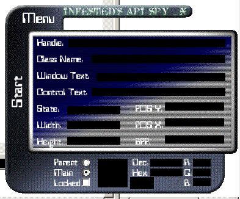

<div align="center">

## API SPY \(Classes\)


</div>

### Description

This API spy shows you how to write to INI files, use windows functions, use enumeration functions, get the color the mouse cursor is on, use GetAsyncKeyState, make forms(windows), logging users (I don't know why), transparent, and put icons in the system tray.

This was just a remake of my other version, which (thanks to my graphics artist) had some insulting language in it. Anyway that graphics are pretty cool and you can thank PhuryX13 for that. I also remade this SPY in C++ if you want to check it out.

Feel free to email me with any questions.
 
### More Info
 
Just post or email all your questions and we'll see if we can answer them.

Slow loading forms, lots of graphics... bites your memory.


<span>             |<span>
---                |---
**Submitted On**   |2000-05-15 00:06:26
**By**             |[Mike A\. Leonetti](https://github.com/Planet-Source-Code/PSCIndex/blob/master/ByAuthor/mike-a-leonetti.md)
**Level**          |Intermediate
**User Rating**    |4.2 (25 globes from 6 users)
**Compatibility**  |VB 3\.0, VB 4\.0 \(16\-bit\), VB 4\.0 \(32\-bit\), VB 5\.0, VB 6\.0, VB Script, ASP \(Active Server Pages\) 
**Category**       |[Complete Applications](https://github.com/Planet-Source-Code/PSCIndex/blob/master/ByCategory/complete-applications__1-27.md)
**World**          |[Visual Basic](https://github.com/Planet-Source-Code/PSCIndex/blob/master/ByWorld/visual-basic.md)
**Archive File**   |[CODE\_UPLOAD57985152000\.zip](https://github.com/Planet-Source-Code/mike-a-leonetti-api-spy-classes__1-8102/archive/master.zip)

### API Declarations

```
There are many, but all included. To list them anyway:
Public Const SW_SHOWNORMAL = 5
Public Const SRCCOPY = &HCC0020
Public Const BITSPIXEL = 12
Public Const HWND_TOP = 0
Public Const HWND_TOPMOST = -1
Public Const HWND_NOTOPMOST = -2
Public Const HWND_BOTTOM = 1
Public Const SWP_NOMOVE = &H2
Public Const SWP_NOSIZE = &H1
Public Const Flags = SWP_NOMOVE Or SWP_NOSIZE
Public Const WM_CLOSE = &H10
Public Const WM_CREATE = &H1
Public Const WM_DESTROY = &H2
Public Const WM_MOVE = 3
Public Const WM_SIZE = 5
Public Const WM_GETTEXT = &HD
Public Const WM_GETTEXTLENGTH = &HE
Public Const WM_SETTEXT = &HC
Public Const WM_CHAR = &H102
Public Const WM_COMMAND = &H111
Public Const WM_LBUTTONDBLCLK = &H203
Public Const WM_LBUTTONDOWN = &H201
Public Const WM_LBUTTONUP = &H202
Public Const WM_RBUTTONDBLCLK = &H206
Public Const WM_RBUTTONDOWN = &H204
Public Const WM_RBUTTONUP = &H205
Public Const WM_MOUSEMOVE = &H200
Public Const WM_PAINT = &HF
Const ERROR = 0
Const NULLREGION = 1
Const SIMPLEREGION = 2
Const COMPLEXREGION = 3
Const RGN_AND = 1
Const RGN_OR = 2
Const RGN_XOR = 3
Const RGN_DIFF = 4
Const RGN_COPY = 5
Public Const SW_HIDE = 0
Public Const SW_MAXIMIZE = 3
Public Const SW_MINIMIZE = 6
Public Const SW_RESTORE = 9
Public Const SW_SHOW = 5
Type Point_API
 X As Long
 Y As Long
End Type
Type Rect
 Left As Long
 Top As Long
 Right As Long
 Bottom As Long
End Type
Public Type COLORRGB
 Red As Long
 Green As Long
 Blue As Long
End Type
Declare Function GetWindowDC Lib "user32" (ByVal hWnd As Long) As Long
Declare Function DeleteObject Lib "gdi32.dll" (ByVal hObject As Long) As Long
Declare Function SetWindowRgn Lib "user32" (ByVal hWnd As Long, ByVal hRgn As Long, ByVal bRedraw As Boolean) As Long
Declare Function CreateRectRgn Lib "gdi32.dll" (ByVal X1 As Long, ByVal Y1 As Long, ByVal X2 As Long, ByVal Y2 As Long) As Long
Declare Function CombineRgn Lib "gdi32.dll" (ByVal hDestRgn As Long, ByVal hSrcRgn1 As Long, ByVal hSrcRgn2 As Long, ByVal nCombineMode As Long) As Long
Declare Function GetPixel Lib "gdi32" (ByVal hDC As Long, ByVal X As Long, ByVal Y As Long) As Long
Declare Function IsWindowVisible Lib "user32" (ByVal hWnd As Long) As Long
Declare Sub ReleaseCapture Lib "user32" ()
Declare Function GetTickCount Lib "kernel32" () As Long
Declare Function ShellExecute Lib "shell32.dll" Alias "ShellExecuteA" (ByVal hWnd As Long, ByVal lpOperation As String, ByVal lpFile As String, ByVal lpParameters As String, ByVal lpDirectory As String, ByVal nShowCmd As Long) As Long
Declare Function SetParent Lib "user32.dll" (ByVal hWndChild As Long, ByVal hWndNewParent As Long) As Long
Declare Function GetUserName Lib "advapi32.dll" Alias "GetUserNameA" (ByVal lpBuffer As String, nSize As Long) As Long
Declare Function SetForegroundWindow Lib "user32.dll" (ByVal hWnd As Long) As Long
Declare Function GetDeviceCaps Lib "gdi32" (ByVal hDC As Long, ByVal nIndex As Long) As Long
Declare Function PostMessage Lib "user32" Alias "PostMessageA" (ByVal hWnd As Long, ByVal Msg As Long, wParam As Any, lParam As Any) As Long
Declare Function GetCursorPos Lib "user32.dll" (lpPoint As Point_API) As Long
Declare Function WindowFromPoint Lib "user32.dll" (ByVal xPoint As Long, ByVal yPoint As Long) As Long
Declare Function GetClassName Lib "user32.dll" Alias "GetClassNameA" (ByVal hWnd As Long, ByVal lpClassName As String, ByVal nMaxCount As Long) As Long
Declare Function GetParent Lib "user32.dll" (ByVal hWnd As Long) As Long
Declare Function GetWindowText Lib "user32.dll" Alias "GetWindowTextA" (ByVal hWnd As Long, ByVal lpString As String, ByVal nMaxCount As Long) As Long
Declare Function GetWindowTextLength Lib "user32.dll" Alias "GetWindowTextLengthA" (ByVal hWnd As Long) As Long
Declare Function GetWindowRect Lib "user32.dll" (ByVal hWnd As Long, lpRect As Rect) As Long
Declare Function SetWindowPos Lib "user32" (ByVal hWnd As Long, ByVal hWndInsertAfter As Long, ByVal X As Long, ByVal Y As Long, ByVal cx As Long, ByVal cy As Long, ByVal wFlags As Long) As Long
Declare Function IsIconic Lib "user32.dll" (ByVal hWnd As Long) As Long
Declare Function IsZoomed Lib "user32.dll" (ByVal hWnd As Long) As Long
Declare Function GetDC Lib "user32.dll" (ByVal hWnd As Long) As Long
Declare Function ReleaseDC Lib "user32.dll" (ByVal hWnd As Long, ByVal hDC As Long) As Long
Declare Function GetDesktopWindow Lib "user32.dll" () As Long
Declare Function GetAsyncKeyState Lib "user32.dll" (ByVal vKey As Long) As Integer
Declare Function EnableWindow Lib "user32.dll" (ByVal hWnd As Long, ByVal fEnable As Long) As Long
Declare Function ShowWindow Lib "user32.dll" (ByVal hWnd As Long, ByVal nCmdShow As Long) As Long
Declare Function SendMessage Lib "user32.dll" Alias "SendMessageA" (ByVal hWnd As Long, ByVal Msg As Long, wParam As Any, lParam As Any) As Long
Declare Function SetWindowText Lib "user32.dll" Alias "SetWindowTextA" (ByVal hWnd As Long, ByVal lpString As String) As Long
Declare Function BitBlt Lib "gdi32.dll" (ByVal hdcDest As Long, ByVal nXDest As Long, ByVal nYDest As Long, ByVal nWidth As Long, ByVal nHeight As Long, ByVal hdcSrc As Long, ByVal nXSrc As Long, ByVal nYSrc As Long, ByVal dwRop As Long) As Long
Declare Function GetPrivateProfileString Lib "kernel32.dll" Alias "GetPrivateProfileStringA" (ByVal lpApplicationName As String, ByVal lpKeyName As Any, ByVal lpDefault As String, ByVal lpReturnedString As String, ByVal nSize As Long, ByVal lpFileName As String) As Long
Declare Function WritePrivateProfileString Lib "kernel32.dll" Alias "WritePrivateProfileStringA" (ByVal lpApplicationName As String, ByVal lpKeyName As String, ByVal lpString As String, ByVal lpFileName As String) As Long
Declare Function GetSystemDirectory Lib "kernel32.dll" Alias "GetSystemDirectoryA" (ByVal lpBuffer As String, ByVal nSize As Long) As Long
Declare Function GetPrivateProfileInt Lib "kernel32.dll" Alias "GetPrivateProfileIntA" (ByVal lpApplicationName As String, ByVal lpKeyName As String, ByVal nDefault As Long, ByVal lpFileName As String) As Long
Declare Function FindWindow Lib "user32.dll" Alias "FindWindowA" (ByVal lpClassName As Any, ByVal lpWindowName As Any) As Long
Declare Function IsWindow Lib "user32.dll" (ByVal hWnd As Long) As Long
Declare Function EnumWindows Lib "user32.dll" (ByVal lpEnumFunc As Long, ByVal lParam As Long) As Long
Declare Function GetWindowsDirectory Lib "kernel32.dll" Alias "GetWindowsDirectoryA" (ByVal lpBuffer As String, ByVal nSize As Long) As Long
Declare Function EnumChildWindows Lib "user32.dll" (ByVal hWndParent As Long, ByVal lpEnumFunc As Long, ByVal lParam As Long) As Long
```


